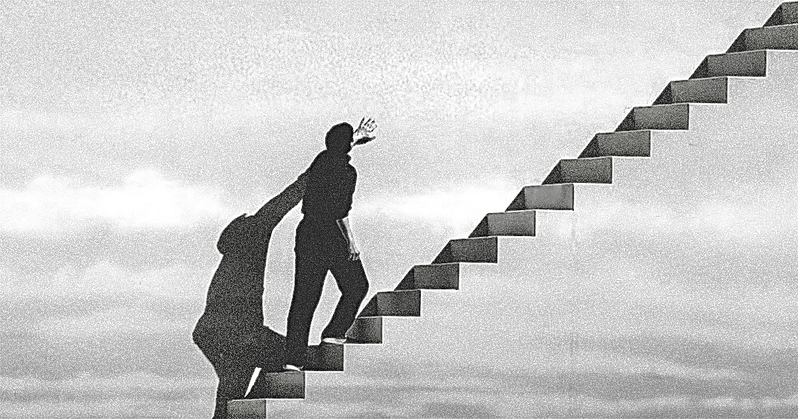

# wexu5990_9103_10
## I would like to do some changes on a screen shot from the movie ‘The Truman Show’ (1998). The movie talks about a man who is unaware that his entire life is a highly constructed reality television show broadcast around the clock to billions of people around the globe. The image is when Truman discovers his life is a lie and seeks to escape, with himself in the middle and walks up the stairs. I want to show the desire of Truman to get out of the space by editing the colour of the image from black to coloured. 

### I decide to use the ‘copy () method’ to simulate colouring image. This will include a black and white image with a coloured image, when mouse is dragged on a space of the image, that part will be coloured with the original colour. 

